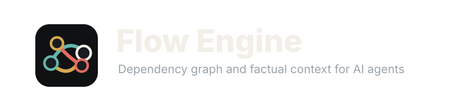
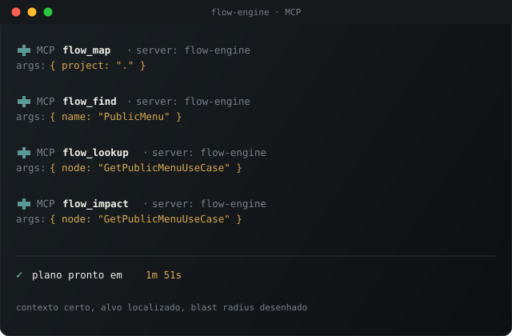

<p align="center">
  
</p>

<p align="center">
  <strong>Local dependency graph and factual context for AI-assisted software work.</strong>
</p>

<p align="center">
  <a href="docs/overview.md">Documentation</a> ·
  <a href="docs/CLI_COMMANDS.md">CLI</a> ·
  <a href="docs/mcp.md">MCP</a> ·
  <a href="docs/docker.md">Docker</a> ·
  <a href="docs/configuration.md">Configuration</a> ·
  <a href="public-api.md">Public API</a> ·
  <a href="ROADMAP.md">Roadmap</a>
</p>

<p align="center">
  
  
  
  
  
</p>

<p align="center">
  
</p>

**Flow Engine** analyzes a codebase on your machine and turns it into a graph an AI assistant can trust: files, symbols, dependencies, cycles, impact, risk, architecture violations, orphan code, bugs, snapshots, and compact context exports.

It is local-first by default. The CLI, MCP server, Docker image, read-only API, parsers, reports, and context exports work without network access, telemetry, accounts, or API keys.

## Why Flow Engine

AI coding tools are strongest when they have precise codebase facts instead of a prompt full of guesses. Flow Engine gives them a deterministic map of the system before they suggest changes.

Use it to:

- Ask an AI assistant about a codebase with grounded context.
- Find cycles, hotspots, or orphaned code before a refactor.
- Estimate impact and risk for a class, method, route, or module.
- Keep local architecture rules enforceable in CI.
- Export reports for code review, planning, and maintenance.
- Expose a local MCP toolset to Claude, Codex, Cline, Continue, or any MCP-compatible client.

## What It Includes

| Area | Included |
| --- | --- |
| Engine | Local static analysis, graph construction, metrics, cycles, impact, risk, architecture checks, orphan detection |
| Languages | PHP, TypeScript, JavaScript, Python, Go, Dart, and Blade |
| Interfaces | CLI, MCP server, local read-only HTTP API, Docker |
| AI context | Minimal/full context exports, entrypoint-focused context, reports, Mermaid text output |
| Change tracking | Filesystem snapshots, compare, drift, cleanup, architecture gate |
| Privacy | No required remote service, no required API key, no required telemetry, no account system |

## Install

From source:

```bash
git clone https://github.com/rborges/flow-engine.git
cd flow-engine
composer install
```

With Docker:

```bash
docker build -t flow-engine .
docker run --rm -v "$PWD:/workspace:ro" flow-engine analyze /workspace
```

Composer package install will be documented here once the package is published.

## Quick Start

Run these commands in any supported project:

```bash
php bin/engine.php analyze .
php bin/engine.php metrics .
php bin/engine.php cycles .
php bin/engine.php orphans . --audit
php bin/engine.php architecture .
php bin/engine.php context . --minimal
```

The last command prints compact, factual context you can paste into an AI assistant or expose through MCP.

## Common Workflows

Inspect the project graph:

```bash
php bin/engine.php nodes .
php bin/engine.php flow .
php bin/engine.php metrics .
```

Plan a change:

```bash
php bin/engine.php impact . "App\\Service\\OrderService::process"
php bin/engine.php change-risk . --node="App\\Service\\OrderService::process"
php bin/engine.php context . --entrypoint="App\\Service\\OrderService::process"
```

Track architecture drift:

```bash
php bin/engine.php snapshot . --save=before-change
php bin/engine.php architecture-gate . --baseline=before-change --fail-on=new
```

Generate local reports:

```bash
php bin/engine.php bugs .
php bin/engine.php diagram . --view=class
php bin/engine.php appmap --catalog=flow-services.json
```

## MCP Server

Flow Engine can run as a local MCP server so AI clients can inspect your codebase through tools instead of relying on pasted context.



```bash
export FLOW_ENGINE_BIN="$PWD/bin/engine.php"
php bin/engine.php mcp
```

The committed `.mcp.json` uses `FLOW_ENGINE_BIN`, so it does not contain machine-specific paths.

See [docs/mcp.md](docs/mcp.md) for setup and available tools.

## Local Read-Only API

Start the API:

```bash
php bin/engine.php api . --host=127.0.0.1 --port=8080
```

Query it:

```bash
curl http://127.0.0.1:8080/health
curl http://127.0.0.1:8080/api/v1/metrics
curl http://127.0.0.1:8080/api/v1/context
```

Public endpoints are GET-only:

`/health`, `/api/v1/metrics`, `/api/v1/cycles`, `/api/v1/architecture`, `/api/v1/orphans`, `/api/v1/nodes`, `/api/v1/edges`, `/api/v1/flow`, `/api/v1/snapshots`, `/api/v1/context`, `/api/v1/bugs`, `/api/v1/appmap`, `/api/v1/appmap-diff`, `/api/v1/compliance-monitor`, `/api/v1/deployment-map`, `/api/v1/devops-map`, `/api/v1/website-map`, and `/api/v1/diagram`.

POST requests return `405`.

## Configuration

Create a starter config:

```bash
php bin/engine.php init .
```

Then edit `flow-engine.json` to define:

- Paths to scan and paths to ignore.
- Architecture layers and allowed dependencies.
- Visibility and entrypoint rules.
- Snapshot retention.
- Optional external project roots for local audits.

Do not store secrets in `flow-engine.json`. Optional LLM providers are configured through environment variables only.

See [docs/configuration.md](docs/configuration.md).

## Optional LLM Providers

The core does not need an LLM. You can still analyze, export, serve MCP tools, and run the read-only API without any provider key.

Optional providers are opt-in:

```bash
export ANTHROPIC_API_KEY=...
export OPENAI_API_KEY=...
export OLLAMA_HOST=http://localhost:11434
export OLLAMA_MODEL=llama3.1
```

When these variables are not present, Flow Engine falls back to local context exports and deterministic reports.

## Docker

Analyze a mounted project:

```bash
docker build -t flow-engine .
docker run --rm -v "$PWD:/workspace:ro" flow-engine analyze /workspace
```

Run the local API:

```bash
docker compose up --build
curl http://127.0.0.1:8080/health
```

See [docs/docker.md](docs/docker.md).

## Security And Privacy

- Local-first: analysis runs against local files.
- No required telemetry.
- No account or payment code.
- No required external runtime.
- API is local and read-only.
- LLM providers are optional and enabled only through environment variables.
- `.claude/` settings are examples; local settings are ignored by Git.

To enable the example Claude Code hooks:

```bash
cp .claude/settings.example.json .claude/settings.json
```

## Development

```bash
composer install
vendor/bin/phpunit --no-coverage
php bin/quality-gate.php --mode=main
```

Docker-only validation:

```bash
docker run --rm -v "$PWD":/src:ro -w /work composer:2 sh -lc \
  'cp -a /src/. . && composer validate --strict && composer install --no-interaction --no-progress && vendor/bin/phpunit --no-coverage'
```

## Roadmap

Open source stays focused on the local engine, CLI, MCP, read-only API, Docker, parsers, graph, metrics, cycles, risk, impact, architecture checks, orphans, context exports, and local reports.

Future paid or closed work will be tracked separately and will not be required for the local open-source core.

See [ROADMAP.md](ROADMAP.md).

## Contributing

Issues and pull requests are welcome. Good first contributions include parser coverage, documentation examples, bug fixtures, and focused tests for graph behavior.

Before opening a PR:

```bash
composer install
vendor/bin/phpunit --no-coverage
php bin/quality-gate.php --mode=main
```

Keep changes local-first, deterministic, and free of required remote services.

## Author / Autor

Flow Engine is created and maintained by [Rodrigo Borges](https://roborg.org), a software developer and architect from Brazil focused on codebase understanding, dependency graphs, refactoring, and AI-assisted software maintenance.

O Flow Engine foi criado e mantido por [Rodrigo Borges](https://roborg.org), desenvolvedor e arquiteto de software no Brasil, com foco em entendimento de codebases, grafos de dependencia, refatoracao e manutencao de software assistida por IA.

More context: [roborg.org](https://roborg.org) · [GitHub](https://github.com/rborges) · [LinkedIn](https://www.linkedin.com/in/rodrigo-borges-dev/)

## License

MIT. See [LICENSE](LICENSE).
