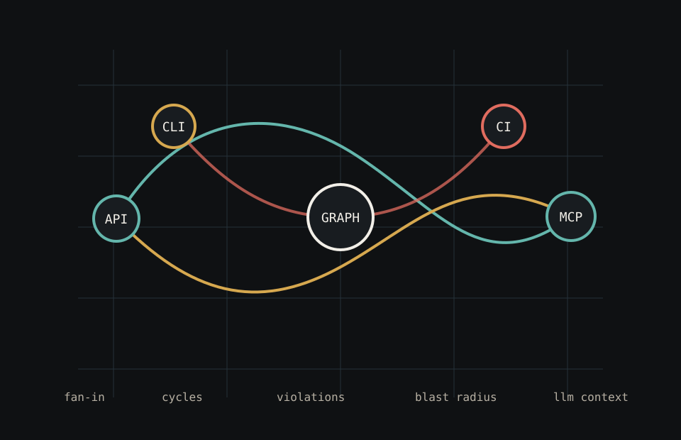

# Flow Engine Documentation

Start with the README if this is your first contact with the project:

- [Project README](../README.md)

Then use the guides below according to what you need next.

## Feature Benefits

- [Local engine](overview.md): understand the real dependency graph before planning a change.
- [Getting started](getting-started.md): get from clone to first analysis on Windows, Linux/macOS, or Docker.
- [CLI commands](CLI_COMMANDS.md): automate analysis in a terminal, script, or CI job.
- [MCP server](mcp.md): give AI assistants local graph tools and reduce manual context copying.
- [Local read-only API](../public-api.md): query Flow Engine from local tools using HTTP GET endpoints.
- [Docker](docker.md): run the same workflow across developer machines and CI without local PHP setup.
- [Configuration](configuration.md): adapt Flow Engine to each repository's structure and architecture rules.
- [Metrics](analysis-tools.md#metrics): find coupling, fan-in, fan-out, and hotspots.
- [Cycles](analysis-tools.md#cycles): identify dependency loops that increase change cost.
- [Architecture](analysis-tools.md#architecture): catch layer violations before they spread.
- [Orphans](analysis-tools.md#orphans): review unused-code candidates with supporting evidence.
- [Impact and risk](analysis-tools.md#impact-and-risk): estimate affected code and change risk before editing.
- [Flow tracing](flow-tracing.md): inspect what a node calls and who calls it.
- [Reports for AI](analysis-tools.md#reports-for-ai): export compact facts for AI-assisted software work.
- [System diagrams](system-diagrams.md): produce Mermaid diagrams and application maps from local analysis.

## First Use

- [Overview](overview.md): what Flow Engine does and where each interface fits.
- [Getting started](getting-started.md): install Flow Engine and analyze a project on Windows, Linux/macOS, or Docker.
- [Configuration](configuration.md): create and edit `flow-engine.json`.
- [CLI commands](CLI_COMMANDS.md): command reference and common examples.

## AI And Integrations

- [MCP server](mcp.md): expose local graph tools to Claude, Codex, Cline, Continue, or another MCP-compatible client.
- [Local read-only API](../public-api.md): HTTP endpoints for local tools.
- [Docker](docker.md): run the CLI or API without installing PHP locally.

## Analysis Guides

- [Analysis tools](analysis-tools.md): metrics, cycles, architecture checks, orphans, impact, risk, and reports.
- [Flow tracing](flow-tracing.md): follow dependencies upstream and downstream from a node.
- [System diagrams](system-diagrams.md): generate Mermaid diagrams and application maps.
- [Concepts](concepts.md): glossary for graph terms used by Flow Engine.

## Maintainers

- [Documentation validation](maintainers/documentation-validation.md): fixture used by the `validate-docs` maintainer command.
